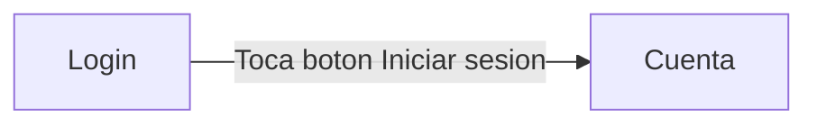

# mercados_campesino_app
## Flujo de la aplicación

## Tabla de saltos

| Desde | Hacia | Acción del usuario | Método de Navegador | Datos que viajan | Pila después del salto |
|-------|-------|-------------------|--------------------|-----------------|----------------------|
| Login | Cuenta | Toca "Iniciar sesión" | Navigator.pushReplacement | correo, contraseña | [Login, Cuenta] |

## Decisiones
- ¿Por qué pushReplacement y no push?: Se utiliza pushReplacement debido a que push se utiliza usualmente cuando los usuarios pueden tener la posiblidad de devolverse. En cambio, pushReplacement reemplaza la pantalla actual con una nueva, no permite volver. Esto es lo más apto para un flujo de Login.
- ¿Por qué viajan estos datos?: Porque son los únicos datos que se digitan a la hora de iniciar sesión.
